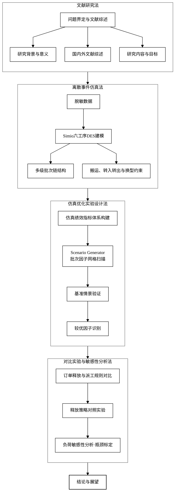

# 开题报告技术路线图预览

在 Cursor 中：

1. 打开本文件，按 `Ctrl+Shift+V` 打开 Markdown 预览（需已装 **Markdown Preview Mermaid Support**）
2. 或 `Ctrl+Shift+P` → 输入 `Mermaid Editor: Open` 打开独立 Mermaid 编辑器（**Mermaid Editor** 插件）

源码文件：`开题报告_技术路线图.mmd`

